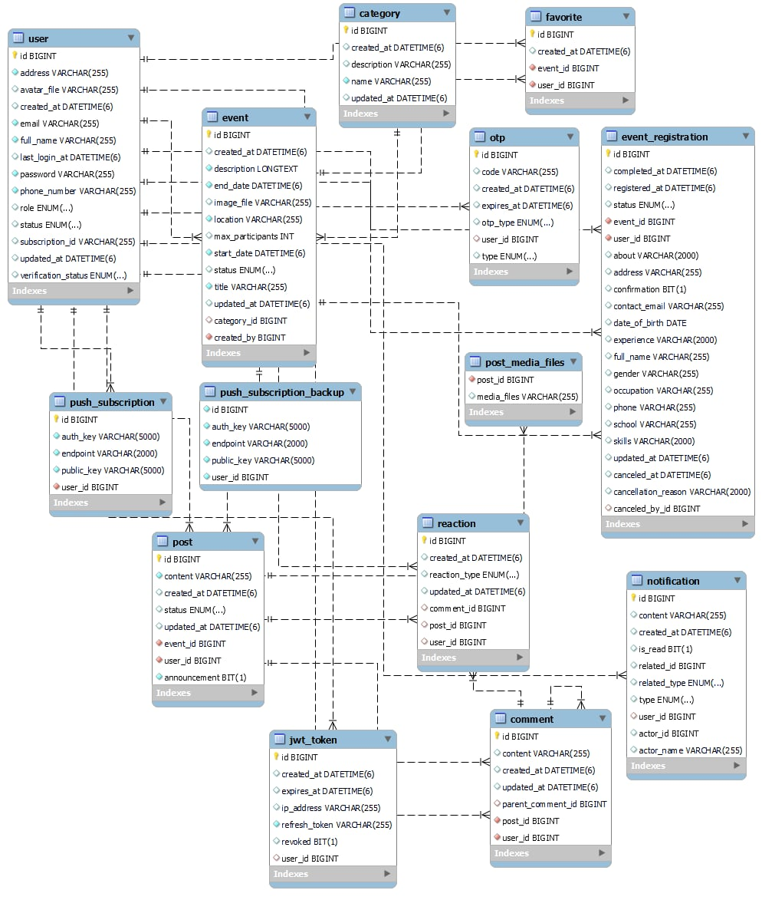

# VolunteerHub Web

## Introduction
This repository contains VolunteerHub — a community volunteering web application with a Java Spring Boot backend and a React (Vite) frontend. Features include events, volunteer registrations, posts & comments, notifications (web push), user management and an admin dashboard.

## Getting Started
**Prerequisites**
- Java 17+ and Maven
## Database Relationship



## Database Setup

- Create a MySQL database for the application (recommended name: volunteer_db).

  1. Create the database (example):

     ```bash
     mysql -u root -p -e "CREATE DATABASE volunteer_db CHARACTER SET utf8mb4 COLLATE utf8mb4_unicode_ci;"
     ```

  2. Import the provided SQL seed/dump file:

     ```bash
     mysql -u root -p volunteer_db < database/volunteer_db.sql
     ```

- Configure the backend to connect to your database. You can set environment variables (preferred) or edit `src/main/resources/application.properties`.

  Example environment variables:

  ```bash
  SPRING_DATASOURCE_URL=jdbc:mysql://localhost:3306/volunteer_db?useSSL=false&serverTimezone=UTC
  SPRING_DATASOURCE_USERNAME=your_db_user
  SPRING_DATASOURCE_PASSWORD=your_db_password
  ```

  Or example `application.properties` entries:

  ```properties
  spring.datasource.url=jdbc:mysql://localhost:3306/volunteer_db?useSSL=false&serverTimezone=UTC
  spring.datasource.username=your_db_user
  spring.datasource.password=your_db_password
  spring.jpa.hibernate.ddl-auto=update
  ```

- Run the backend (Windows):

  ```bash
  cd backend/VolunteerHub
  mvnw.cmd spring-boot:run
  ```

- Notes:
  - The SQL dump used by this project is at [database/volunteer_db.sql](database/volunteer_db.sql).
  - For cloud deployments (Heroku), prefer supplying datasource variables via the platform's config vars and ensure `server.ssl.enabled` is disabled or keystore values are provided via environment-safe secrets.
- Node.js (18+) and npm
- MySQL (or configured database)

### Step 1 — Backend
- Project location: [backend/VolunteerHub](backend/VolunteerHub)
- Configuration: see [backend/VolunteerHub/src/main/resources/application.properties](backend/VolunteerHub/src/main/resources/application.properties)
  - Note: `server.ssl.enabled=true` and keystore entries are present in this repo for local TLS testing. On Heroku or other PaaS disable embedded SSL and let the platform handle TLS (see Troubleshooting below).

Run backend locally:

```bash
cd backend/VolunteerHub
# If using the wrapper on Windows
mvnw.cmd spring-boot:run
# or on *nix
./mvnw spring-boot:run
```

Import database schema or set your datasource in `application.properties` before running.

### Step 2 — Frontend
- Project location: [frontend](frontend)
- Environment variable for uploaded files: `.env.development` contains `VITE_UPLOAD_BASE` (default used for building URLs to `/uploads`).

Run frontend locally:

```bash
cd frontend
npm install
npm run dev
```

Open the site at the Vite dev server URL (usually `http://localhost:5173`). The frontend expects backend API under `/api` (proxy configured in development) or update the `baseURL` in [frontend/src/api/axios.js](frontend/src/api/axios.js).

## Database Setup

## This Application (Features)
## Complete Feature List

The following is a comprehensive list of features implemented (or supported) by VolunteerHub. It covers general/common functionality (auth, profile, uploads), event & registration workflows, social features, notifications, and admin/manager capabilities. Use this as a reference when exploring the code or extending the app.

1. Authentication & Account Management
  - User registration (email + password) with validation.
  - Login / logout with JWT-based auth and refresh tokens (backend issues tokens; frontend stores token in localStorage).
  - Forgot password / reset flow using OTP codes (generate, send, verify, reset password).
  - Email verification and account status (UNVERIFIED / VERIFIED, ACTIVE / BANNED).
  - Change password and secure password hashing.

2. Profiles & Avatars
  - User profile page with editable fields: full name, phone, address, public profile, avatar.
  - Avatar sources: uploaded files served under `/uploads` (configurable via `VITE_UPLOAD_BASE`) or local assets under `frontend/src/images`.
  - Upload handling and URL builder: see `frontend/src/utils/files.js`.

3. Events
  - Create / edit / delete events with title, description, category, start/end time, location and capacity.
  - Event statuses: PENDING, APPROVED, REJECTED, COMPLETED, CANCELED.
  - Recurring or repeated events can be created by duplicating event entries (manager/admin workflows support re-run).
  - Event visibility and searching (category filters, keyword search, pagination).

4. Registrations (Volunteer Signups)
  - Users can register for events (EventRegistration entity) with statuses: PENDING, APPROVED, REJECTED, CANCELED, COMPLETED.
  - Event managers can view registrations for their events and change statuses (approve/reject/complete).
  - Leaderboard / top volunteers counts APPROVED + COMPLETED registrations; hours tracking supports daily cap (8h/day rule implemented in backend service logic).
  - Users can cancel their registrations when allowed by event rules.

5. Posts, Comments & Reactions (Social / Event Channel)
  - In-event channels where users can create posts, upload attachments, comment and react (LIKE/LOVE/...) to posts.
  - Post moderation: post approval workflow and admin/manager moderation (remove, pin, or reject content).
  - Nested comments and ability to edit/delete own comments within allowed time windows.

6. Notifications & Web Push
  - Web push subscription management (save/remove subscriptions per user) via `PushSubscription` entity and `PushSubscriptionController`.
  - VAPID keys and server push service (see `WebPushNotificationService` and `webpush-test.js`).
  - Service worker (`frontend/public/sw.js`) parses payload and displays human-friendly notifications (prefers `content`/`message` fields and strips HTML).
  - Custom notifications: admins/managers can send event-specific custom notifications.

7. Admin & Event Manager Capabilities
  - Event Manager (`EVENT_MANAGER`): create/edit events, manage registrations for events they own, moderate event posts, export event reports (CSV), and send notifications to participants.
  - Admin (`ADMIN`): full platform management — user management (assign roles), event/category management, global moderation, system metrics, push integration, data import/export and maintenance tasks (dedupe push subscriptions script available under `backend/scripts`).
  - Role-based dashboard views: `DashboardService` and related controllers return different datasets depending on role (newPosts, newEvents, trendingEvents filtered appropriately).

8. Reporting & Exports
  - Event reports (EventReportDTO) include participant counts, approved participants and post counts.
  - Admin export utilities (frontend admin export UI) can download CSV reports.

9. File Uploads & Static Resources
  - Uploaded files are served under `/uploads` (backend exposes resource handler in `WebConfig`).
  - Frontend `VITE_UPLOAD_BASE` controls the upload URL base in development (`.env.development`).

10. API & Backend Notes
   - Backend: Spring Boot, Spring Security, JPA/Hibernate, ModelMapper.
   - Key controllers: `EventController`, `EventRegistrationController`, `PostController`, `NotificationController`, `UserController`, `PushSubscriptionController`.
   - DTOs and entities mirror each important business domain: `EventDTO`, `EventRegistrationDTO`, `PostDTO`, `NotificationDTO`, etc.
   - Security: JWT auth, role checks, and method-level checks in services/controllers.

11. Environment, Build & Run
   - Backend: `backend/VolunteerHub` — run with the wrapper: `mvnw.cmd spring-boot:run` (Windows) or `./mvnw spring-boot:run` (Unix).
   - Frontend: `frontend` — `npm install` then `npm run dev`.
   - Frontend expects API under `/api` by default (see `frontend/src/api/axios.js`). Adjust proxy or `baseURL` if needed.
   - Important envs: `VITE_UPLOAD_BASE` (frontend), DB connection properties and `server.ssl.*` settings (backend `application.properties`).


## Resources
- Backend: Spring Boot + Spring Security + JPA/Hibernate
- Frontend: React + Vite + axios
- Web push: web-push integration and `WebPushNotificationService` in backend

## Features by Role
The application assigns capabilities by role. Below are typical features available to each role and notes about repeatable actions.

- **User (VOLUNTEER):**
  - Browse and search events, view event details and organizer information.
  - Register for events; view and manage own registrations (cancel or edit where allowed).
  - Participate in event channels: create posts, comment, react to posts.
  - Manage personal profile: update avatar (upload or choose local), contact info, and notification preferences.
  - Receive push notifications (subscribe/unsubscribe) and email notifications where configured.
  - Repeatability: users can register for multiple events and update/cancel registrations as allowed by event status.

- **Event Manager (EVENT_MANAGER):**
  - Create and edit events, set categories, dates and capacity.
  - View registrations for events they manage; approve, reject or mark registrations as completed.
  - Moderate posts within their event channels (remove inappropriate content, pin posts).
  - Export event reports (participants, posts) and communicate with volunteers via custom notifications.
  - Repeatability: managers can publish recurring/duplicate events, re-open or re-run events, and re-send notifications or reports.

- **Admin (ADMIN):**
  - Full management of the platform: create/update/delete events, users, and categories.
  - Manage roles and permissions: assign `EVENT_MANAGER` or `ADMIN` roles to users.
  - Oversee moderation across all events and posts, merge or remove content, and handle escalations.
  - Access system reports and dashboards (metrics, trending events, top volunteers).
  - System operations: manage push subscriptions, VAPID keys, and integration settings.
  - Repeatability: admins can backfill data, re-run imports, regenerate reports and re-run notification campaigns.

Permissions are enforced on the backend; UI renders actions according to the authenticated user's role.

## Developers / Maintainers
- Project root: [VolunteerHubWeb](./)
- Backend: [backend](backend/VolunteerHub)
- Frontend: [frontend](frontend)

### Developer
#### Duong Minh Kien [PigCassoKien] (https://github.com/PigCassoKien):
- Database Design
- Collect data and Connect to database
- BackEnd Develop
- UX Develop
- API integration
- API testing

#### Nguyen Duc Long [nglong-uet] (https://github.com/nglong-uet):
- FrontEnd Develop
- BackEnd Develop
- UI Devlop
- UX Develop
- API integration

#### Le Vu Duc Hieu [LHieu24] (https://github.com/LHieu24):
- UI Design
- Requirements analysis
- UI Develop
- Data collection and storage

## Learn more
- Spring Boot: https://spring.io/projects/spring-boot
- React + Vite: https://vitejs.dev/guide/
- Web Push: https://developers.google.com/web/fundamentals/push-notifications

## Project Status
Active development — backend and frontend edits have been applied. Please run the local servers to verify end-to-end behavior.

## Note
This application is for educational usage. See source files in `backend/VolunteerHub` and `frontend` for implementation details.
